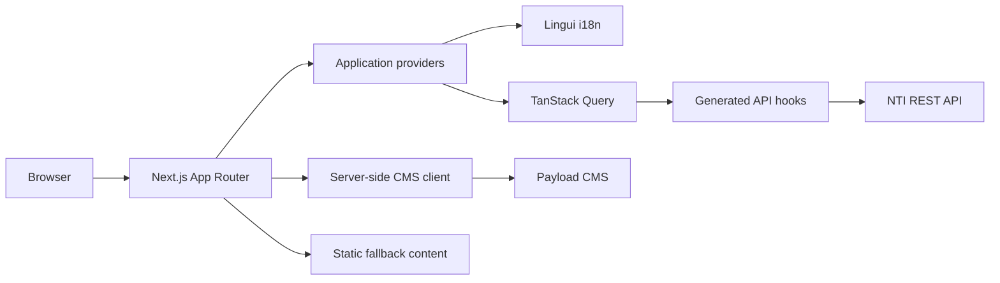

<div align="center">

# NTI — Innovation Hub Frontend

**Web platform for the Nitriansky technologický inkubátor**

Connecting students, startups, companies, mentors, reviewers, and administrators through innovation programs and technology-driven projects.

[](https://nextjs.org/)
[](https://react.dev/)
[](https://www.typescriptlang.org/)
[](https://tailwindcss.com/)
[](https://lingui.dev/)
[](#license)

</div>

---

## About the project

**NTI Frontend** is the client application for the Nitriansky technologický inkubátor innovation platform.

The application provides public information about NTI and dedicated workspaces for the different participants of the ecosystem. It supports student onboarding, company collaboration, mentoring, application review, administration, and the complete lifecycle of NTI's Program A and Program B activities.

The frontend is built with the Next.js App Router and communicates with the NTI REST API through a generated, type-safe API layer. Public website content can be loaded from a Payload CMS, with static fallback content available when the CMS is not configured.

---

## Main capabilities

### Public website

- NTI landing page
- Information about NTI programs
- Partner and mentor presentation
- News and article pages
- Public calls
- Contact form
- Terms of service and privacy policy
- CMS-managed public content

### Authentication and onboarding

- User login
- Student registration
- Company-owner registration
- Email verification
- Forgotten-password and password-reset flows
- Team invitation onboarding
- Organization invitation onboarding
- Initial profile setup
- Role-aware redirects and access control

### Student workspace

- Student dashboard
- Personal and academic profile
- Academic verification
- Team management
- Program A applications
- Application drafts and submissions
- Program B backlog browsing
- Program B project workspace
- Account and security settings

### Company workspace

- Company dashboard
- Organization profile and documents
- Program B backlog management
- Program B project management
- Collaboration with students and mentors
- Organization invitation flows

### Mentor workspace

- Mentor dashboard
- Program A project supervision
- Program B project supervision
- Mentorship notes and project follow-up

### Reviewer workspace

- Assigned application overview
- Application detail and evaluation
- Criterion-based scoring
- Review decisions and supporting comments

### Administration

- Application moderation
- Public-call management
- User management
- Organization management
- Academic-structure management
- Invitation management
- Program B project administration
- Reports and data exports
- Administrative access guards

---

## User roles

| Role | Main workspace |
| --- | --- |
| Student | Profile, team, applications, Program A and Program B |
| Company | Organization, backlog items, projects, collaboration |
| Mentor | Assigned Program A and Program B projects |
| Reviewer | Application evaluation and scoring |
| Administrator | Platform configuration, moderation, users, organizations, reports |

---

## Technology stack

### Core

| Technology | Purpose |
| --- | --- |
| [Next.js 16](https://nextjs.org/) | App Router, server rendering, routing, metadata, image handling |
| [React 19](https://react.dev/) | User-interface layer |
| [TypeScript](https://www.typescriptlang.org/) | Strict static typing |
| [Tailwind CSS 4](https://tailwindcss.com/) | Styling and responsive design |

### UI and forms

| Technology | Purpose |
| --- | --- |
| [Radix UI](https://www.radix-ui.com/) | Accessible UI primitives |
| shadcn-style components | Reusable application UI components |
| [Lucide React](https://lucide.dev/) | Icons |
| [React Hook Form](https://react-hook-form.com/) | Form state and validation integration |
| [Zod](https://zod.dev/) | Runtime schemas and form validation |
| [Sonner](https://sonner.emilkowal.ski/) | Toast notifications |

### Data and state

| Technology | Purpose |
| --- | --- |
| [TanStack Query](https://tanstack.com/query/latest) | Server-state fetching, caching, and mutations |
| [Axios](https://axios-http.com/) | HTTP communication |
| [Zustand](https://zustand.docs.pmnd.rs/) | Lightweight client-side state |
| [Day.js](https://day.js.org/) | Date and time utilities |

### API and content

| Technology | Purpose |
| --- | --- |
| [Orval](https://orval.dev/) | API hooks and service generation |
| [openapi-typescript](https://openapi-ts.dev/) | OpenAPI type generation |
| Payload CMS integration | Public content and media |
| OpenAPI schema | Source of truth for the generated API client |

### Developer experience

| Technology | Purpose |
| --- | --- |
| ESLint | Static code analysis |
| Prettier | Code formatting |
| Husky | Git hooks |
| lint-staged | Validation of staged files |
| Commitlint | Conventional Commit enforcement |
| Commitizen | Interactive commit creation |
| Madge | Circular-dependency detection |
| GitHub Actions | Automated linting and production builds |
| Vercel Speed Insights | Frontend performance monitoring |

---

## Architecture overview



The application combines:

- **server components** for server-side rendering and content loading;
- **client components** for interactive forms, workspaces, mutations, and local state;
- **TanStack Query** for API state;
- **generated OpenAPI hooks** for typed backend communication;
- **Lingui** for English and Slovak localization;
- **Payload CMS** for public content.

---

## Project structure

```text
NTI_frontend/
├── .github/
│   └── workflows/              # Continuous-integration workflows
├── .husky/                     # Git hooks
├── public/                     # Static assets, icons, and favicons
├── scripts/
│   └── api-codegen/            # OpenAPI download and code-generation scripts
├── src/
│   ├── app/                    # Next.js App Router pages and layouts
│   │   ├── (auth)/             # Authentication and registration routes
│   │   ├── (marketing)/        # Public website routes
│   │   ├── account/            # Account settings and security flows
│   │   ├── admin/              # Administration workspace
│   │   ├── company/            # Company workspace
│   │   ├── mentor/             # Mentor workspace
│   │   ├── review/             # Reviewer workspace
│   │   ├── student/            # Student workspace
│   │   └── styles/             # Global styles
│   ├── components/
│   │   ├── admin/              # Shared administration components
│   │   ├── company-dashboard/  # Company workspace components
│   │   ├── i18n/               # Language controls
│   │   ├── layout/             # Public layout components
│   │   ├── providers/          # Query and localization providers
│   │   ├── shadcn/             # Reusable UI primitives
│   │   ├── student-dashboard/  # Student workspace layout
│   │   └── workspace/          # Shared internal-workspace components
│   ├── features/               # Domain-oriented feature modules
│   │   ├── account-settings/
│   │   ├── mentor-program-a/
│   │   ├── student-profile/
│   │   └── student-workspace/
│   ├── lib/
│   │   ├── api/                # Generated API hooks and schemas
│   │   ├── api-client/         # API runtime and compatibility layer
│   │   ├── auth/               # Authentication and authorization helpers
│   │   ├── cms/                # Server-side CMS client
│   │   ├── constants/          # Routes and shared constants
│   │   ├── files/              # File validation helpers
│   │   ├── i18n/               # Localization runtime and server helpers
│   │   └── student-dashboard/  # Student data helpers and normalizers
│   ├── locales/
│   │   ├── en/                 # English message catalog
│   │   └── sk/                 # Slovak message catalog
│   ├── services/               # Application services
│   └── store/                  # Zustand stores
├── .env.example
├── lingui.config.ts
├── next.config.ts
├── package.json
└── tsconfig.json
```

### Architectural conventions

- Files in `src/app` should focus on routing and page composition.
- Reusable presentation components belong in `src/components`.
- Domain-specific logic and UI belong in `src/features`.
- Shared utilities, authorization, API code, constants, and integrations belong in `src/lib`.
- API-generated files should be updated through the code-generation commands rather than edited manually.
- Absolute imports are resolved from `src`, for example:

```ts
import { Button } from 'components/shadcn';
import { ROUTES } from 'lib/constants';
```

---

## Requirements

Use the same major Node.js version as the CI environment.

- **Node.js 20.x**
- **npm**
- Running NTI backend API
- Payload CMS instance for dynamic public content, optional during local development

Check your installed versions:

```bash
node --version
npm --version
```

---

## Getting started

### 1. Clone the repository

```bash
git clone https://github.com/YDVPWebDevTeam/NTI_frontend.git
cd NTI_frontend
```

### 2. Install dependencies

Use `npm ci` for a clean, reproducible installation based on `package-lock.json`:

```bash
npm ci
```

For regular dependency updates during development, `npm install` can also be used.

### 3. Configure environment variables

Create a local environment file from the example:

```bash
cp .env.example .env.local
```

Windows PowerShell:

```powershell
Copy-Item .env.example .env.local
```

Update the values in `.env.local`:

```env
NEXT_PUBLIC_API_URL="http://localhost:3001/api/v1"
NEXT_PUBLIC_CMS_URL="http://localhost:3002"
API_DOCS_URL="http://localhost:3001/api/docs-json"
```

### 4. Start the development server

```bash
npm run dev
```

The `predev` script automatically compiles Lingui translation catalogs before Next.js starts.

Open:

```text
http://localhost:3000
```

---

## Environment variables

| Variable | Required | Description |
| --- | --- | --- |
| `NEXT_PUBLIC_API_URL` | Yes | Base URL of the NTI REST API, including its API prefix |
| `NEXT_PUBLIC_CMS_URL` | No | Base URL of the Payload CMS; local development defaults to `http://localhost:3002` |
| `API_DOCS_URL` | For codegen | URL of the backend OpenAPI JSON document |

### CMS fallback behavior

When no CMS URL is available in production, CMS-aware pages can fall back to built-in static content. In local development, the CMS client uses `http://localhost:3002` by default.

---

## Available commands

| Command | Description |
| --- | --- |
| `npm run dev` | Compile translations and start the development server |
| `npm run build` | Compile translations and create a production build |
| `npm run start` | Start the compiled production application |
| `npm run lint` | Run ESLint |
| `npm run typescript` | Run TypeScript validation without emitting files |
| `npm run extract` | Extract translatable messages |
| `npm run compile` | Compile Lingui catalogs |
| `npm run clean:lingui` | Re-extract messages and remove obsolete entries |
| `npm run madge` | Detect circular dependencies |
| `npm run madge:json` | Export circular-dependency results as JSON |
| `npm run api-codegen` | Download the OpenAPI schema and regenerate the complete API layer |
| `npm run generate:openapi` | Fetch and prepare the OpenAPI schema |
| `npm run generate:services` | Generate API services and hooks |
| `npm run generate:compat` | Generate the compatibility layer |
| `npm run generate:public-api` | Generate public API exports |
| `npm run commit` | Create a Conventional Commit interactively |
| `npm run lint:staged` | Run staged-file validation |
| `npm run commitlint` | Validate a commit message |

---

## Localization

The application uses [Lingui](https://lingui.dev/) and currently supports:

- `en` — English, source language
- `sk` — Slovak

Translation catalogs are stored as PO files:

```text
src/locales/en/messages.po
src/locales/sk/messages.po
```

### Translation workflow

After adding or changing translatable text:

```bash
npm run extract
```

Translate the new entries in the Slovak catalog, then compile catalogs:

```bash
npm run compile
```

To remove obsolete messages while extracting:

```bash
npm run clean:lingui
```

A normal development or production build also compiles translations automatically.

---

## API client generation

The frontend API layer is generated from the backend OpenAPI document.

Ensure that:

1. the backend is running;
2. `API_DOCS_URL` points to a valid OpenAPI JSON endpoint;
3. the schema matches the backend version used by the frontend.

Regenerate everything with:

```bash
npm run api-codegen
```

The complete pipeline performs these stages:

```text
fetch OpenAPI schema
        ↓
prepare schema
        ↓
generate services and React Query hooks
        ↓
generate compatibility exports
        ↓
generate public API exports
```

Generated modules are placed primarily under:

```text
src/lib/api/
src/lib/api-client/
```

After regeneration, review the diff and run all validation commands before committing.

---

## Routes and workspaces

The principal route groups include:

| Area | Examples |
| --- | --- |
| Public | `/`, `/about`, `/programs`, `/partners`, `/mentors`, `/news`, `/calls` |
| Authentication | `/login`, `/register/student`, `/register/company-owner`, `/forgot-password` |
| Student | `/student/dashboard`, `/student/profile`, `/student/team`, `/student/applications` |
| Student Program B | `/student/program-b/backlog`, `/student/program-b/projects` |
| Company | `/company/dashboard`, `/company/organization`, `/company/program-b/*` |
| Mentor | `/mentor/dashboard`, `/mentor/program-a/projects`, `/mentor/program-b/projects` |
| Reviewer | `/review/dashboard`, `/review/applications/[id]` |
| Administration | `/admin`, `/admin/moderation`, `/admin/calls`, `/admin/users`, `/admin/organizations` |
| Account | `/account` and account-security confirmation routes |

Centralized route definitions are maintained in:

```text
src/lib/constants/routes.ts
```

Prefer using the exported `ROUTES` object instead of hard-coding internal URLs.

---

## Data fetching and application providers

The root application layout initializes:

- the active Lingui locale and message catalog;
- the TanStack Query client;
- global Sonner notifications;
- Vercel Speed Insights.

Typical client-side data flow:

```text
page or feature component
        ↓
generated React Query hook
        ↓
configured API runtime
        ↓
NTI backend
```

Use generated hooks whenever an endpoint already exists in the OpenAPI schema. Keep one-off manual HTTP requests limited to integrations that are not represented by the backend schema.

---

## Styling and UI

The project uses Tailwind CSS 4 together with accessible Radix UI primitives and reusable shadcn-style components.

General guidelines:

- reuse an existing component before introducing a new primitive;
- keep workspace layouts consistent across roles;
- use shared variants for statuses, buttons, cards, and alerts;
- preserve keyboard navigation and visible focus states;
- provide loading, empty, and error states for asynchronous views;
- keep responsive behavior in mind for dashboards and data-heavy pages.

The application uses the Geist and Geist Mono font families through `next/font`.

---

## Code quality

Before opening a pull request, run:

```bash
npm run lint
npm run typescript
npm run madge
npm run build
```

A useful single local check is:

```bash
npm run lint && npm run typescript && npm run madge && npm run build
```

### Continuous integration

GitHub Actions runs on pushes to `main` and pull requests targeting `main`.

The current workflow:

1. installs dependencies with `npm ci`;
2. runs ESLint;
3. creates a production build;
4. uses Node.js 20.x.

---

## Git workflow

The repository uses [Conventional Commits](https://www.conventionalcommits.org/) enforced by Commitlint and Husky.

Recommended commit command:

```bash
npm run commit
```

Common commit types:

| Type | Usage |
| --- | --- |
| `feat` | New functionality |
| `fix` | Bug fix |
| `refactor` | Internal restructuring without a behavior change |
| `style` | Formatting or visual-only changes |
| `docs` | Documentation |
| `test` | Test additions or corrections |
| `chore` | Tooling, dependencies, or maintenance |
| `build` | Build-system changes |
| `ci` | Continuous-integration changes |

Examples:

```text
feat(student): add Program B project detail view
fix(auth): preserve redirect after email verification
refactor(api): simplify generated compatibility exports
docs(readme): document local development setup
```

---

## Pull request checklist

Before requesting review, verify that:

- the feature works for the intended role;
- authorization and route guards still behave correctly;
- loading, empty, success, and error states are covered;
- new user-facing text is translatable;
- Slovak translations are updated where required;
- generated API files are synchronized with the backend schema;
- no circular dependency was introduced;
- lint, TypeScript validation, and the production build pass;
- no secret or local environment file is committed.

---

## Production build

Create an optimized build:

```bash
npm run build
```

Start it locally:

```bash
npm run start
```

The production environment must provide at least:

```env
NEXT_PUBLIC_API_URL="https://api.example.com/api/v1"
NEXT_PUBLIC_CMS_URL="https://cms.example.com"
```

`NEXT_PUBLIC_CMS_URL` may be omitted when the deployment intentionally uses static fallback content.

---

## Troubleshooting

### The frontend cannot reach the backend

Verify:

- `NEXT_PUBLIC_API_URL` contains the correct protocol, host, port, and API prefix;
- the backend is running;
- browser requests are allowed by the backend CORS configuration;
- the environment file is named `.env.local`;
- the development server was restarted after changing environment variables.

### API hooks are missing or outdated

Regenerate the client:

```bash
npm run api-codegen
```

Confirm that `API_DOCS_URL` returns valid OpenAPI JSON.

### Translations are missing

Run:

```bash
npm run extract
npm run compile
```

Then restart the development server.

### CMS images are not displayed

Verify:

- `NEXT_PUBLIC_CMS_URL` points to the correct CMS host;
- the returned media URL is valid;
- the CMS is reachable from the Next.js server;
- the CMS host is included through the dynamic image configuration.

### Build passes locally but fails in CI

Use Node.js 20.x and reinstall dependencies exactly from the lock file:

```bash
rm -rf node_modules .next
npm ci
npm run build
```

Windows PowerShell:

```powershell
Remove-Item node_modules, .next -Recurse -Force -ErrorAction SilentlyContinue
npm ci
npm run build
```

---

## Security notes

- Never commit `.env.local` or real credentials.
- Only variables prefixed with `NEXT_PUBLIC_` are exposed to browser code.
- Keep authorization checks in place even when navigation hides restricted pages.
- Treat generated API types as compile-time assistance, not as a replacement for server-side validation.
- Validate uploaded files before sending them to the backend.
- Review authentication, invitation, and account-confirmation flows carefully when changing redirects.

---

## Related services

This repository contains the **frontend application**. A complete local environment may also require:

- the NTI backend REST API;
- the backend OpenAPI documentation endpoint;
- the Payload CMS instance;
- configured email and file-storage services on the backend side.

---

## License

No license file is currently specified in this repository. Add an explicit license before distributing or reusing the source code outside the project team.

---

<div align="center">

Built for the **Nitriansky technologický inkubátor** innovation ecosystem.

</div>
